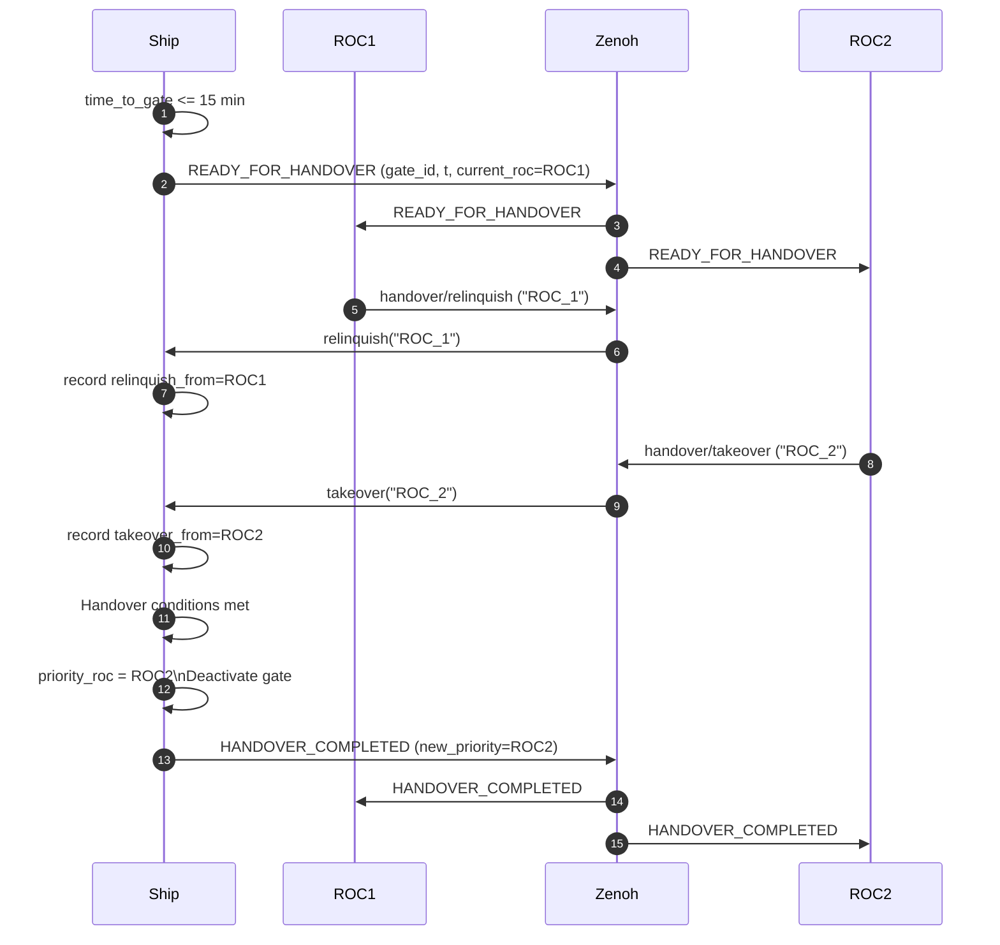

# MASS Vessel Simulator

A lightweight Python simulation of a Maritime Autonomous Surface Ship (MASS) that publishes navigation data using **Zenoh** and **Keelson** payload schemas.  
The simulator now includes a method to transfer command authority between Remote Operating Centers (ROCs).

---

#  New in This Version

###  **ROC Priority System**
Only the ROC marked as **priority controller** may command the vessel.  
Other ROCs sending COG/SOG commands are **ignored**.

###  **ROC-Aware Control Topics**
In addition to legacy topics:

```
MASS_0/COG
MASS_0/SOG
```

You can now send ROC-specific control commands:

```
MASS_0/control/roc/<ROC_ID>/COG
MASS_0/control/roc/<ROC_ID>/SOG
```

Example:

```
MASS_0/control/roc/ROC_2/COG
```

###  **Handover Protocol**
The ship automatically begins a handover process when it is **within 15 minutes of a safety gate**.

Handover requires:

| Step | Condition |
|------|-----------|
| 1 | Ship broadcasts `READY_FOR_HANDOVER` |
| 2 | Current ROC sends `handover/relinquish` |
| 3 | Next ROC sends `handover/takeover` |
| 4 | Ship **switches priority ROC**, deactivates gate, broadcasts `HANDOVER_COMPLETED` |

###  **Safety Gate Deactivation**
Upon successful handover, the safety gate involved in the negotiation is automatically **deactivated**.

---

#  One-line demo

```bash
docker-compose up
```

---

# 1. Installation

```bash
pip install eclipse-zenoh protobuf matplotlib keelson
```

---

# 2. Running the Simulation

```bash
python3 ship_sim.py
```

This:

1. Starts a MASS vessel named **MASS_0**
2. Publishes navigation and ROC state at 5 Hz
3. Begins monitoring for control + handover messages

Enable plotting:

```python
ship.simulate(frequency_hz=5, duration_sec=30, live_plot=True)
```

---

# 3. Published Topics

## Navigation (Keelson)

| Field                     | Key                                           | Type                   |
|--------------------------|-----------------------------------------------|------------------------|
| GNSS Fix                 | `rise/@v0/MASS_0/location_fix/gnss/0`         | `LocationFix`          |
| COG (deg)                | `rise/@v0/MASS_0/course_over_ground_deg/gnss/0` | `TimestampedFloat`   |
| SOG (knots)              | `rise/@v0/MASS_0/speed_over_ground_knots/gnss/0` | `TimestampedFloat`   |

## Registrar

| Field | Key |
|-------|------|
| Name  | `rise/@v0/MASS_0/name/registrar/0` |
| MMSI  | `rise/@v0/MASS_0/mmsi_number/registrar/0` |
| IMO   | `rise/@v0/MASS_0/imo_number/registrar/0` |

## Bridge Status

| Field             | Key                                   |
| ----------------- | ------------------------------------- |
| Navigation Status | `rise/@v0/MASS_0/nav_status/bridge/0` |
| ROC Status        | `rise/@v0/MASS_0/roc_status/bridge/0` |

## Remote Status

| Field                 | Key                                                     |
|-----------------------|---------------------------------------------------------|
| Message               | `rise/@v0/MASS_0/pubsub/remote_status/bridge/0`         |
| Time to safety gate   | `rise/@v0/MASS_0/pubsub/remote_time/bridge/1`           |

---

# 4. Controlling the Ship

## Legacy control topics (treated as priority ROC)

| Action | Topic | Payload |
|--------|--------|----------|
| Set COG | `MASS_0/COG` | `TimestampedFloat` |
| Set SOG | `MASS_0/SOG` | `TimestampedFloat` |
| Set state | `MASS_0/state` | `"go"` / `"no-go"` |
| Update safety gate | `MASS_0/gates` | `"IDENT STATUS"` |

---

## NEW: ROC-Aware Control Topics

```
MASS_0/control/roc/<ROC_ID>/COG
MASS_0/control/roc/<ROC_ID>/SOG
```

The ship **only accepts commands** from:

```
priority_roc_id
```

All other ROC commands are rejected.

---

# 5. NEW: Handover Topics

## Ship broadcasts:

| Purpose | Topic | Payload |
|---------|--------|----------|
| Start handover | `rise/@v0/MASS_0/handover/request` | `READY_FOR_HANDOVER ...` |
| Completed handover | `rise/@v0/MASS_0/handover/state` | `HANDOVER_COMPLETED ...` |

## ROCs send:

| Purpose | Topic | Payload |
|---------|--------|----------|
| Current ROC relinquishes control | `MASS_0/handover/relinquish` | `"ROC_1"` |
| Next ROC takes control | `MASS_0/handover/takeover` | `"ROC_2"` |

---

# 6. Handover Sequence Diagram



---

# 7. Safety Gate Behavior

* Ship goes `no-go` inside an active safety gate.  
* Ship computes **time-to-gate** based on kinematics.  
* Auto-handovers begin at **15-minute threshold**.

---

# 8. Live Plotting

Plot includes:

- Vessel trajectory  
- Active & inactive safety gates  
- Status overlay text  
- Real-time updates during simulation  
---

# 9. Workflow

1. Start simulator:

```bash
python3 ship_sim.py
```

2. Send ROC commands:

### ROC 1 relinquish:
```bash
zenoh-pub MASS_0/handover/relinquish "ROC_1"
```

### ROC 2 takeover:
```bash
zenoh-pub MASS_0/handover/takeover "ROC_2"
```

3. Ship automatically changes priority to ROC 2 and deactivates gate.

---

# 10. Zenoh Shutdown

```python
if Ship._zenoh is not None:

